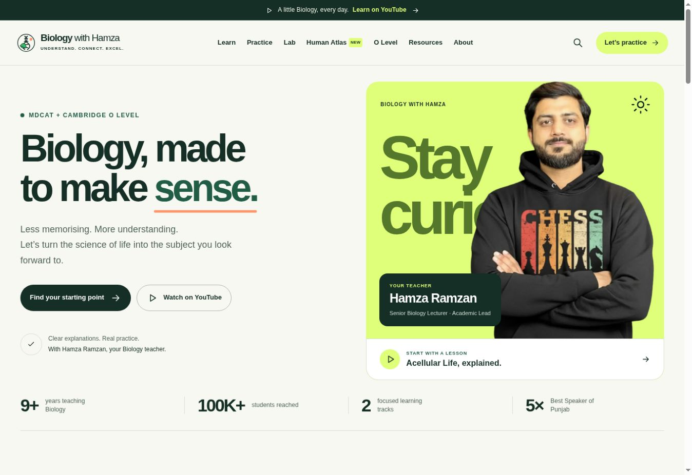

# Biology with Hamza

The official teaching website of Hamza Ramzan, with concept-driven Biology for
MDCAT and Cambridge O Level learners, a 1,600-question practice centre with
100 MCQs in every chapter, searchable
article and lesson libraries, nineteen Cambridge 5090 topic routes, and an
organized student-resource directory. Large content cards are fully clickable,
with keyboard-visible focus, responsive microinteractions and reduced-motion
support throughout the site. Orange surfaces use contrast-checked foreground
colours, and the practice centre now requires a device-based student ID before
starting a forward-only, randomized attempt.



## New in the September redesign

- A new light learning-studio interface, green/lime/orange palette, fully clickable
  content cards, keyboard search and responsive navigation.
- Human Atlas at `/atlas`: 2,234 selectable structures, 15 systems, region
  filters, organ search, isolation, rotation and zoom.
- Biology Lab at `/lab`: interactive enzyme saturation, osmosis and genetic crosses.
- Reading focus and printable article revision sheets.

The atlas uses adult male BodyParts3D reference anatomy. It does not include a
female model or all human anatomical variation. Detailed WebGL rendering loads
on demand; devices without WebGL automatically use a reduced-detail canvas
renderer made from the same reference geometry. Full attribution and licences
are in `public/atlas/ATTRIBUTION.md`. Preserve the entire `public/atlas` folder.

## Upload this update

Extract the ZIP. Upload its contents directly into your GitHub repository root,
where `app`, `public`, `package.json` and `netlify.toml` already live. Commit all
files once to `main`. Upload the contents, not the ZIP or an extra outer folder.
Your hosting configuration can stay as it is. This package has not been deployed.

See `REFINEMENT_SUMMARY.md` for checks and the atlas scope.

## Practice profiles

The included student ID is deliberately browser-based: it works on the current
static Netlify deployment without a database, email, password, or additional
service. It separates attempt history on the same device, but it is not a secure
login and does not synchronize across devices. A real account system would require an authentication provider and server-side
storage. No remote account service or database is included in this release.

## Netlify deployment

This repository is ready to connect directly to Netlify. The included
`netlify.toml` automatically uses:

- build command: `npm run build:netlify`
- publish directory: `out`
- Node.js 22

See [NETLIFY_DEPLOYMENT.md](NETLIFY_DEPLOYMENT.md) for first-time deployment,
GitHub updates, and custom-domain instructions.

## Editing the website

Start with [EDITING_GUIDE.md](EDITING_GUIDE.md). The main editing files are:

- `app/content.ts` — public links and featured videos;
- `app/article-data.ts` — article titles, metadata, diagrams, tables, and text;
- `app/page.tsx` — homepage wording and sections;
- `app/about/page.tsx` — biography and teaching profile;
- `app/cambridge-o-level/page.tsx` — Cambridge 5090 syllabus and skills route;
- `app/cambridge-o-level/topics.ts` — all nineteen Cambridge topic routes;
- `app/practice/questions.ts` — original MDCAT questions and bank integration;
- `app/practice/concept-bank.ts` — chapter concepts used for the expanded MCQ bank;
- `app/practice/quiz.tsx` — student profiles and the forward-only quiz flow;
- `app/practice/quiz-randomization.ts` — fresh question selection and answer-choice shuffling;
- `app/resources/resources.ts` — searchable student-resource directory;
- `app/globals.css` — colours, typography, and layout;
- `public` — profile photo, thumbnails, and browser icon.

## Local commands

```bash
npm install
npm run dev:netlify
npm run build:netlify
```

The Netlify build produces the static website in `out`. The existing
`npm run build` command remains available for the original Sites environment.
